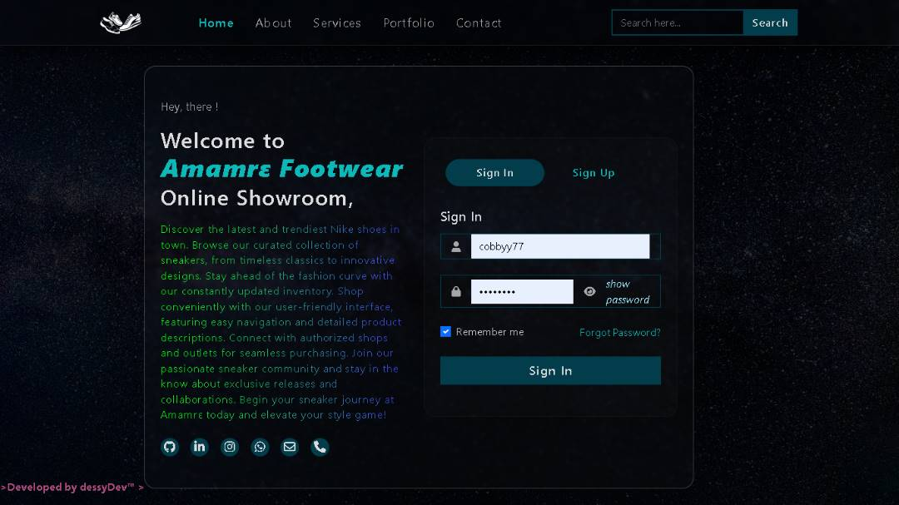
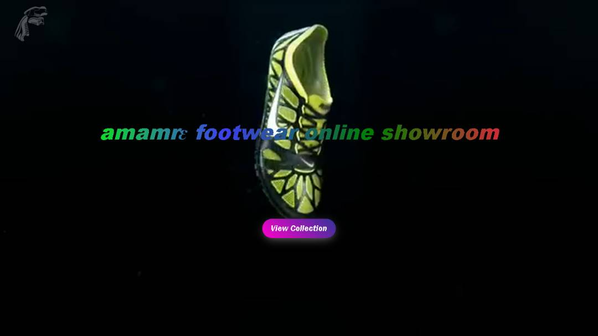
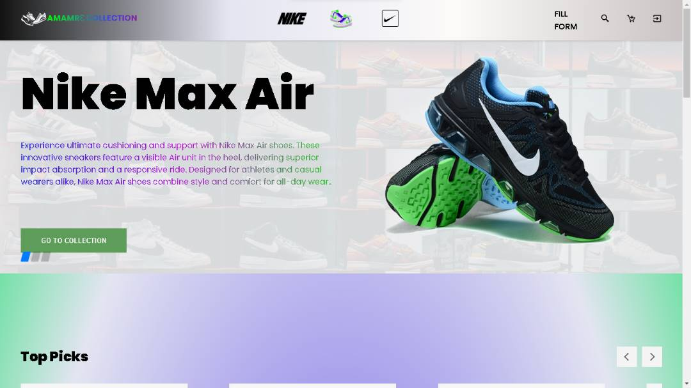
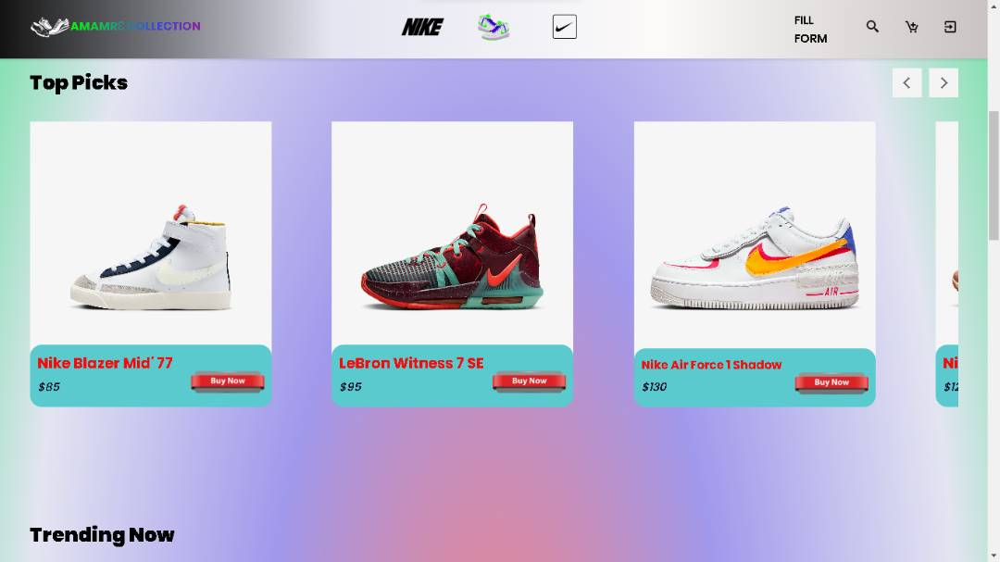
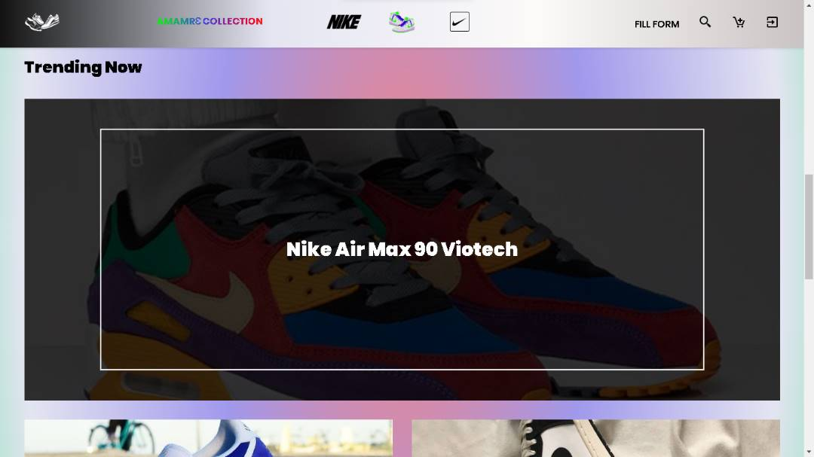
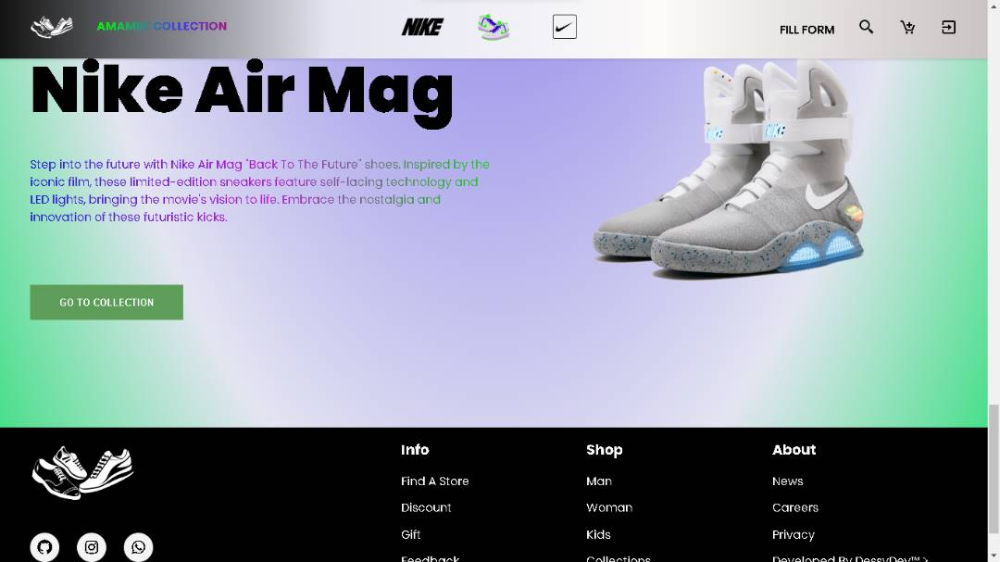

# AMMAMRƐ ONLINE FOOTWEAR SHOWROOM
Welcome to the AMMAMRƐ ONLINE FOOTWEAR SHOWROOM, your ultimate destination for trendy Nike sneakers at affordable prices. 
This README.md guide will walk you through the different processes and interactions within the web app.

## Table of Contents
- [Getting Started](#getting-started)
- [Features](#features)
- [Usage](#usage)
  - [Creating an Account](#creating-an-account)
  - [Logging In](#logging-in)
  - [Exploring the Homepage](#exploring-the-homepage)
  - [Browsing the Product Catalogue](#browsing-the-product-catalogue)
  - [Purchasing](#purchasing)
- [Contributing](#contributing)
- [License](#license)

## Getting Started

To get started with the AMMAMRƐ ONLINE FOOTWEAR SHOWROOM, ensure you have a modern web browser. 
Simply visit our website https://ammamr3.vercel.app/ to access the platform.

<table  style="border-collapse: collapse;">
	<tbody>
	<tr>
	<td style="border: none; border-top: hidden;" align="Center" width="50%">
 				   login page
 	</td>
		<td style="border: none; border-top: hidden;" align="Center" width="50%">
 				   Landing page
 	</td>
	</tr>
	<tr>
	<td style="border: none; border-top: hidden;" align="Center" width="50%">
 				   Home page
 	</td>
		<td style="border: none; border-top: hidden;" align="Center" width="50%">
 				   Product section
 	</td>
	</tr>
		<tr>
	<td style="border: none; border-top: hidden;" align="Center" width="50%">
 				   Trendy product section
 	</td>
		<td style="border: none; border-top: hidden;" align="Center" width="50%">
 				   footer section
 	</td>
		</tr>
	</tbody>
</table>

## <i>Features
- Browse and discover the latest and trendiest Nike shoes in town.
- Curated collection of sneakers, including timeless classics and innovative designs.
- Constantly updated inventory to stay ahead of the fashion curve.
- User-friendly interface with easy navigation and detailed product descriptions.
- Integration with Firebase for secure login and signup page authentication.
- Connect with authorized shops and outlets for seamless purchasing.
- Sneaker community updates on exclusive releases and collaborations.
- Elevate your style game with Amamrɛ footwear online showroom.
</i>

## Usage

### Creating an Account

1. Visit the website and click on the "Sign Up" button.
2. Fill in your details and create a unique username and password.
3. Click "Sign Up" to create your account.

### Logging In

1. Click on the "Log In" button.
2. Enter your username and password.
3. Click "Log In" to access your account.

### Getting on the Landing page

1. Upon logging in, you'll be redirected to a landing page.
2. It has an inplay video of nike shoe playing on mute and loops after itself.
3. There is a button with "see collection" inscription which will rediret you to the homepage.

### Exploring the Homepage

1. upon clicking on the "see collection" button, you will be redirected to the homepage.
2. Discover featured products, trending releases, and community discussions.

### Browsing the Product Catalogue

1. Navigate to the "Product Catalogue" section.
2. Use search and filter options to narrow down your preferences.
3. Click on a product to view detailed information.

### Purchasing

1. From the product page, click on the "Buy Now" button.
2. You'll be redirected to the linked online store for the purchase.
3. Complete the transaction on the external site.

## Contributing

We welcome contributions to enhance the AMMAMRƐ ONLINE FOOTWEAR SHOWROOM. If you'd like to contribute, please follow our [contributing guidelines](CONTRIBUTING.md).

## License

This project is not currently licensed.

# built with

 <table>
 	<tbody>
 		<tr>
 			<td style="border: none; border-top: hidden;" align="Center" width="30%">
 				   HTML
 			</td>
 			<td style="border: none; border-top: hidden;" align="Center" width="30%">
 				   CSS
 			</td>
 			<td style="border: none; border-top: hidden;" align="Center" width="30%">
 				   Bootstrap
 			</td>
			<td style="border: none; border-top: hidden;" align="Center" width="30%">
 				   JavaScript
 			</td>
			<td style="border: none; border-top: hidden;" align="Center" width="30%">
 				   Firebase
 		</tr>
 	</tbody>
 </table>
 

	Thanks for reading!

