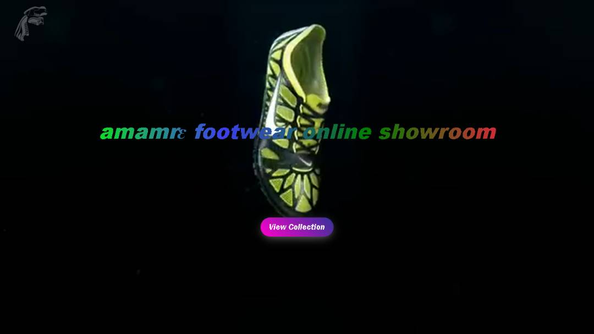
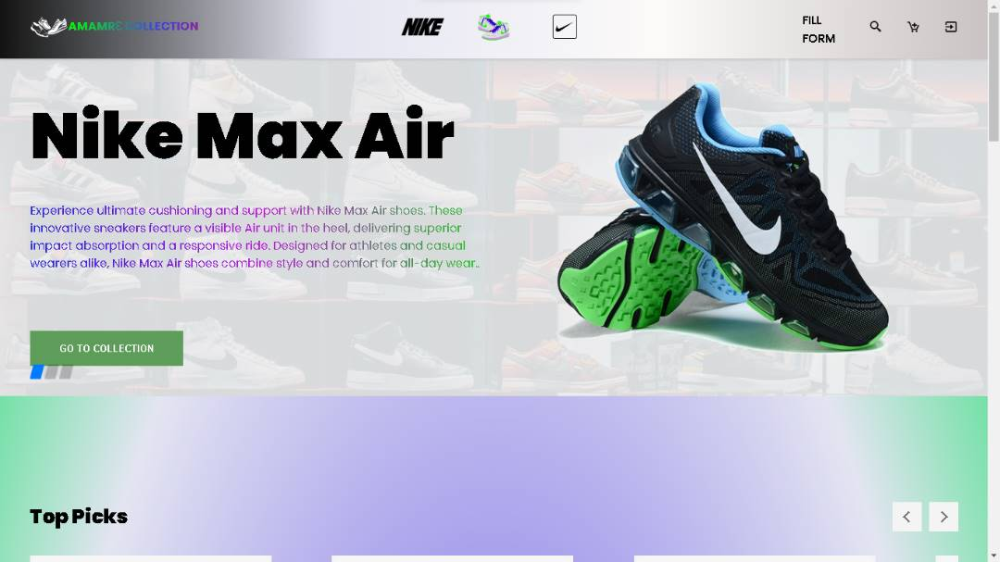
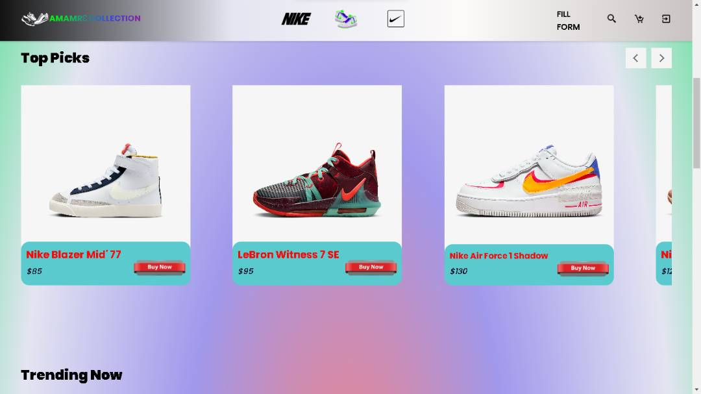
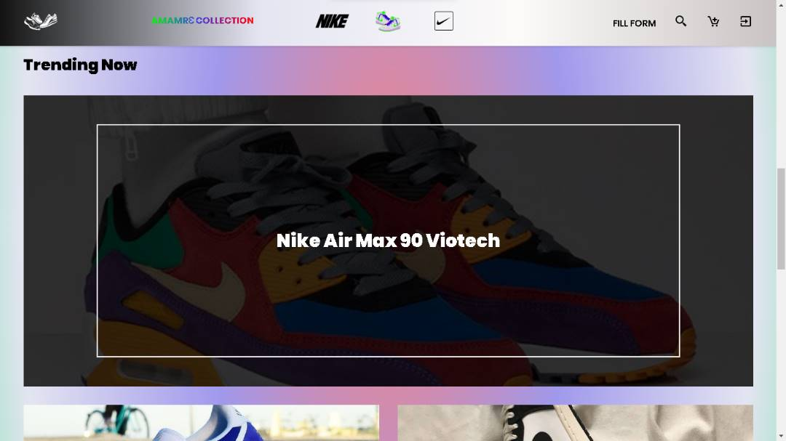
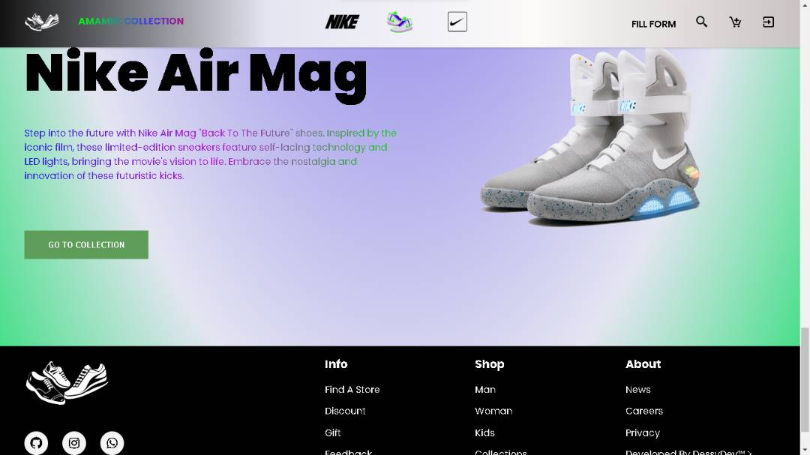

# Amamrɛ Online Shop

<table>
	<tbody>
	<tr>
	<td align="Center" width="30%">
 				   login page
 			</td>
	
	</tr>
	</tbody>
</table>

## Features

- Browse and discover the latest and trendiest Nike shoes in town.
- Curated collection of sneakers, including timeless classics and innovative designs.
- Constantly updated inventory to stay ahead of the fashion curve.
- User-friendly interface with easy navigation and detailed product descriptions.
- Integration with Firebase for secure login and signup page authentication.
- Connect with authorized shops and outlets for seamless purchasing.
- Sneaker community updates on exclusive releases and collaborations.
- Elevate your style game with Amamrɛ footwear online showroom.

## <i>This is the repository for the Amamrɛ Online Shop, an e-showroom website for footwear. The project is built using HTML, CSS, JavaScript, Bootstrap, and integrates Firebase for login and signup page authentication.</i>

 <table>
 	<tbody>
 		<tr>
 			<td align="Center" width="30%">
 				   HTML
 			</td>
 			<td align="Center" width="30%">
 				   CSS
 			</td>
 			<td align="Center" width="30%">
 				   Bootstrap CSS
 			</td>
			<td align="Center" width="30%">
 				   JavaScript
 			</td>
			<td align="Center" width="30%">
 				   Firebase
 		</tr>
 	</tbody>
 </table>
 

	Thanks for reading!

