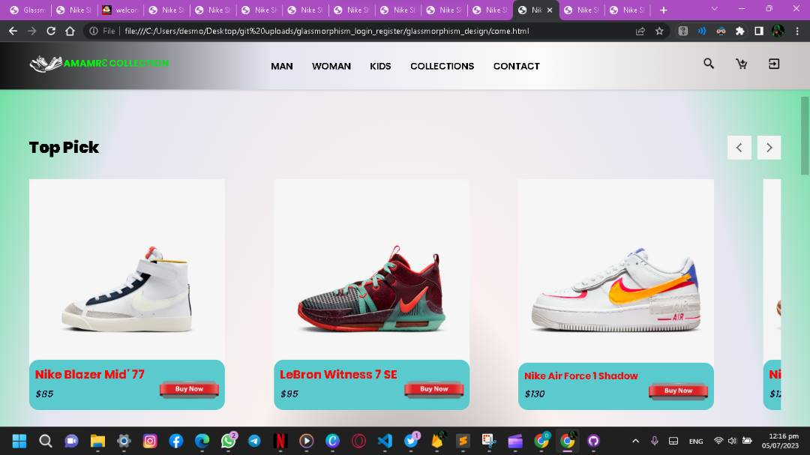

README
# Amamrɛ Online Shop

This is the repository for the Amamrɛ Online Shop, an e-commerce website for footwear. The project is built using HTML, CSS, JavaScript, Bootstrap, and integrates Firebase for login and signup page authentication.

## Features

- Browse and discover the latest and trendiest Nike shoes in town.
- Curated collection of sneakers, including timeless classics and innovative designs.
- Constantly updated inventory to stay ahead of the fashion curve.
- User-friendly interface with easy navigation and detailed product descriptions.
- Integration with Firebase for secure login and signup page authentication.
- Connect with authorized shops and outlets for seamless purchasing.
- Sneaker community updates on exclusive releases and collaborations.
- Elevate your style game with Amamrɛ footwear online showroom.

?branch=
